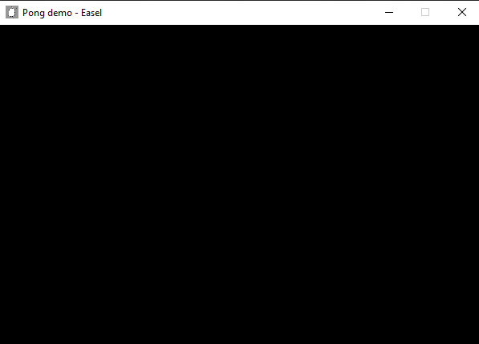

# Pong Tutorial
In order to start learning the in and outs of the engine, let's write a simple little game!

This tutorial will utilize the majority of the basic features required in order to make your way around this engine, so that you can start making the things that you want to!

Note: This tutorial assumes a basic knowledge of C#, or at least of programming in general. 

For basic setup, make sure you've read the [Getting Started]() page.  
In order to fully understand the concepts and code used in this tutorial, make sure you've read over the [Concepts to Understand]() page.

For simplification, I would recommend naming your project "GramPong" like I have, just so there isn't any namespace confusion as we go along the tutorial.

## Setting up a window

To begin with, let's set up some basic game engine code to get a window running! To do this, go into your Program.cs file (which will serve as the entry point to our program) and import the following namespace:
```cs
using GramEngine.Core;  
// Note that here, you're importing the namespace of your project.
// I named my GramPong, but yours would probably be your ProjectName.
using GramPong;
```
Next we'll initialize and instantiate a ``WindowSettings`` object, to let GramEngine know some basic properties of our window. There's quite a few different parameters we can set here, but we won't worry about them in this tutorial.
```cs
WindowSettings windowSettings = new WindowSettings()
{
    NaiveCollision = true,
    WindowTitle = "Pong demo",
    Width = 600,
    Height = 400
};
```
Now that we have our basic ``WindowSettings`` object, we can go ahead and make our main window, and with it, utilize the game class to have our game run! 
```cs
Window window = new Window(new MainScene(), windowSettings);
```
You might notice that your IDE doesn't like the fact we don't have a ``MainScene`` defined yet - don't worry, we'll get to that in a second. For now, just know that this window class is where everything starts from. The moment we run this window class, everything will start up!
```cs
window.Run();
```
With that, we're done with setting up our entry point! But as said before, this won't run yet, as we need to actually make a Scene for it to start running with.

## Setting up a basic scene
Here's where we'll write the bulk of our code, and make up our own game world.
In your project, create a new file with a class named "MainScene". 

in Visual Studio:

in Jetbrains Rider:

Next, we're going to import the ``GramEngine.Core`` namespace to the file. At the top of the file, write:
```cs
using GramEngine.Core;
```
Then, thanks to this namespace, we'll go ahead and inherit the ``GameState`` class from GramEngine.
```cs
// Again, this'll be your project's namespace. My project is named GramPong, hence the code here.
namespace GramPong;  
  
public class MainScene : Scene  
{  

}
  ```
  
With all this set and done, go ahead and run your project!
You should see a black window, like this:


