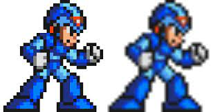
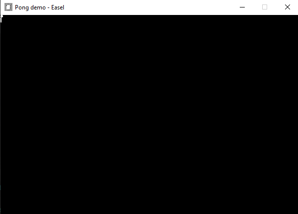
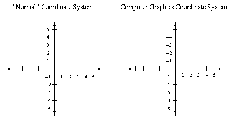
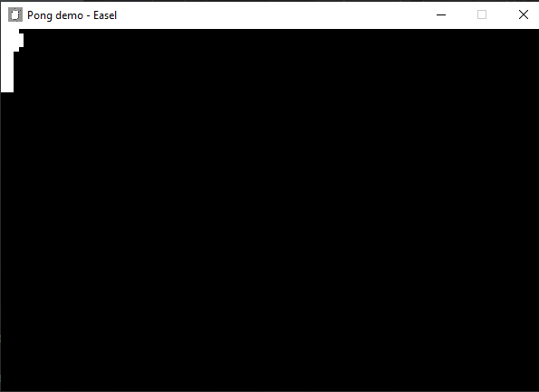
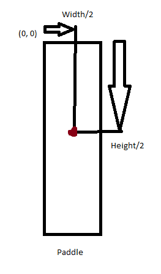
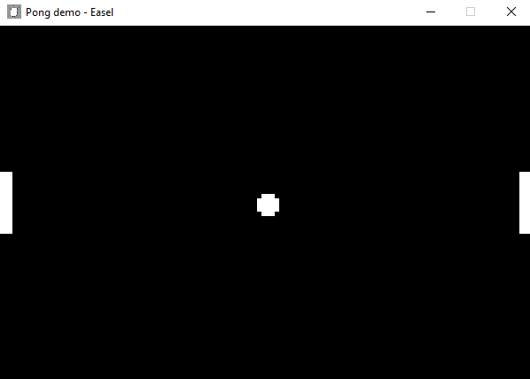

# Initializing our Scene
To start off with, let's add a few more namespaces from the GramEngine to our project, that we'll be using in this section.
At the top of ``MainScene.cs``, import the following:
```cs
using GramEngine.ECS;
using GramEngine.ECS.Components;
using System.Numerics;

//...
```
Now that we have that out of the way, we can start tackling the basics of Scenes!
In GramEngine, each individual "game world" is represented by a ``GameState``. In this tutorial, we won't be implementing anything more than just a base pong game, but in a bigger game, we might want to implement separate areas of play.

In GramEngine, the ``GameState`` class has its own overridable methods that we can utilize to make certain things happen during certain events. Two methods you'll be commonly using (and the ones that will be mainly used in this tutorial) are the ``Initialize()`` and ``Update()`` methods.

``Initialize()`` is called once upon the ``GameState`` being loaded. Here, we can set up all of the basic game data we want as soon as the scene is loaded.

``Update()`` is called once every frame. That is, to say, if our game was ever running at 60 frames a second, any code implemented in ``Update()`` will be run 60 times a second.

With all this in mind, let's begin implementing our ``MainScene``! Let's first override the ``Initialize`` method:
```cs
//...
public override void Initialize()  
{  
    base.Initialize();

}
```
Here, note the call to ``base.Initialize();`` - this is needed for any code that might be internally run within the engine upon each and every scene being loaded. 

With ``Initialize()`` declared, we can begin implementation. For starters, we'll set the camera project to Orthographic (so that the camera will properly render our 2D Sprites) and set each Texture's mode to Nearest/Point. 
> An orthographic projection is a means of representing our objects into a flat, 2d plane, which helps visualize non-3D games with purely 2 dimensional objects. This is in contrast to a perspective projection, which would commonly be used for 3d games!

> Texture sampling/filtering refers to how the pixels of your image behave when rendered on screen. For games with sprites or pixel art, point/nearest neighbor is almost certainly the way to go, but for everything else something else like bilinear sampling would probably be preferable.\
> Pictured: left (Point/Nearest) vs right (Bilinear)
> 
> 

```cs
//...
public override void Initialize()  
{  
    base.Initialize();  
    // Cannot actually change from nearest to bilinear yet, but the above is still nice to know
}
```

We'll also override the ``Update`` method while we're at it. We won't be utilizing the scene's ``Update`` very much, and it won't be till much later, but it'll be nice to have it down after we've just gone over it.

```cs
public override void Update(GameTime gameTime)  
{  
    base.Update(gameTime);
}
```
# Entities and Components
Before we go any further, let's add some basic assets to our project. 

//insert images here and how to add them to project blabla

in Visual Studio:

in Jetbrains Rider:

In GramEngine, entities represent objects in your code that can store all kinds of different ``Component``s. They are basically blank slates meant to store collections of data and behavior, that we can use to define the objects in our game world.

Knowing this, let's start off by initializing some entities for the three main game objects in a game of pong: the ball and two paddles.

Let's quickly declare some variables for our entities in our ``MainScene`` class.

```cs
public class MainScene : GameState
{

    private Entity ball;
    private Entity leftPlayer;
    private Entity rightPlayer;
    //...
```

With that settled, let's get everything initialized!

```cs
public override void Initialize()  
{  
    base.Initialize();  
  
    // We create our paddle and ball entities, add appropriate sprite and associated components, then add them to the scene.  
    ball = new Entity();  
    leftPlayer = new Entity();  
    rightPlayer = new Entity();  

}
```

These entities don't quite represent anything just yet; they're just empty objects, waiting to be filled with data.
Let's give them some life by attaching a sprite to draw them on screen!

In your project, create a folder/directory named "Content", and add the following ball.png and paddle.png images there. 

[ball image](images/ball.png) <br>
[paddle image](images/paddle.png)

> Make sure you also add a reference to where they end up in the output directory!
> You can do this by adding a project reference in your project files (aka, your <ProjectName.csproj> file), like so:

```cs
<ItemGroup>
        <Content Include="Content\**">
            <CopyToOutputDirectory>PreserveNewest</CopyToOutputDirectory>
        </Content>
    </ItemGroup>
    <ItemGroup>
        <Folder Include="Content" />
    </ItemGroup>
```

With this, we can now add ``Sprite`` components to our entities!
To do this, we can call the ``AddComponent`` method on our ``Entity`` objects:

```cs
//...
ball.AddComponent(new Sprite("Content/ball.png"));
leftPlayer.AddComponent(new Sprite("Content/paddle.png"));
rightPlayer.AddComponent(new Sprite("Content/paddle.png"));
```

Voila! you've created three entities and added ``Sprite`` components to all of them! With this, all that's left is to actually add them to the scene, which we can do just by calling the scene's ``AddEntity()`` method.

```cs
//...
AddEntity(leftPlayer);
AddEntity(rightPlayer);
AddEntity(ball);
```
If you run the project now, you'll see your balls and paddles! \
But you might notice something...



The ball and paddles are really small. Like, REALLY small. Not only that, but they're stuck to the top left corner of the screen! What's happening?

To understand, this, let's look at what a ``Transform`` is.

# Transform
In GramEngine, every single entity has a ``Transform`` attributed to them. This is used to represent transformation data, in relation to mathematics. This includes things like position, rotation, scale, and the origin.

By default, all entities in GramEngine are instantiated at position (0, 0), which corresponds to the top left the screen. In computer graphics, it's standard to to have the origin point at the top left of the screen, unlike what you might have seen in math class. 



Alongside this fact, things like scale are automatically set to an x and y value of 1, meaning that any ``Sprite`` components attributed to that entity are rendered as the exact size of the original image you give it. For instance, if you gave the ``Transform``'s x scale value a 2, it would be twice as wide. Our ball.png and paddle.png images are only a few pixels big, so they're accordingly rendered as such in our window.

To fix this, we can change some of the ``Transform`` values in our ball and paddle entities. Beforehand, let's set some constant values that I've come up with that work great with our game:

```cs
public class MainScene : GameState
{
    public const float PaddleSize = 7f;
    public const float BallSize = 5f;
    //...
```

Underneath the ``AddComponent()`` calls we defined earlier, let's use these constants to set some appropriate values for the position, scale, and origin of our entities.

```cs
// Initialize
// ...
rightPlayer.AddComponent(new Sprite(paddleTexture));

// NEW
// Some size refactoring to better fit the screen + gameplay
ball.Transform.Scale = new Vector2(BallSize, BallSize);
leftPlayer.Transform.Scale = new Vector2(PaddleSize, PaddleSize);
rightPlayer.Transform.Scale = new Vector2(PaddleSize, PaddleSize);
```
All the different transformations under ``Transform`` all utilize a ``Vector3`` or ``Vector2``, representing a mathematical vector. For our purposes, this utilizes the format (x, y, z), but the z axis won't matter for this 2d game. (You'll see I'll always just be setting it to 1)

Noting the ``BallSize`` and ``PaddleSize`` constants we set earlier, we now know that this code is setting the size of the ball and paddle images to be 5 and 7 times larger, respectively. If you run the program now, you can see this in action!



The origin represents the center of which the transformation is based around. With (0, 0) representing the top left, sprites are also based around the top left corner by default. By default, the origin is already set to the middle of the sprite, so that we can show positional changes better. We do this by setting the origin to the center of the image (half of the width/length).

Following this, we'll set all the other relevant aspects of transform. 

```cs
//...
var paddleWidth = leftPlayer.GetComponent<Sprite>().Width;
var paddleHeight = leftPlayer.GetComponent<Sprite>().Height;

ball.Transform.Position = new Vector3(300f, 200f, 1f);
        leftPlayer.Transform.Position = new Vector3(paddleWidth * PaddleSize / 2, 
            GameStateManager.Window.Height / 2, 1f
            );
        rightPlayer.Transform.Position = new Vector3(
            GameStateManager.Window.Width - paddleWidth * PaddleSize / 2, 
            GameStateManager.Window.Height / 2, 1f
        );
```



After this, we set the position of the ball and paddle entities. Keeping in mind that our window is 600 wide by 400 pixels tall, we set the ball to be in the center of the screen, the left player to be on the center left edge of the screen, and the right player to be on the center right edge of the screen. 

``GameStateManager`` is a class available under ``GramEngine.Core`` that has a variety of different references and utilities - in our case, it lets us get the current dimensions of our window, which we use to set the corresponding center in each respective dimension.

With all this done, running our program grants us the correct starting positions for pong!

