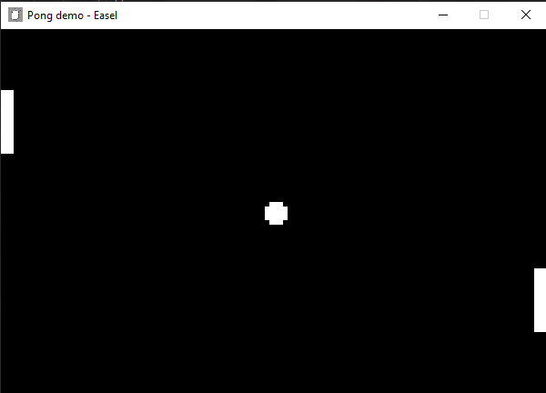
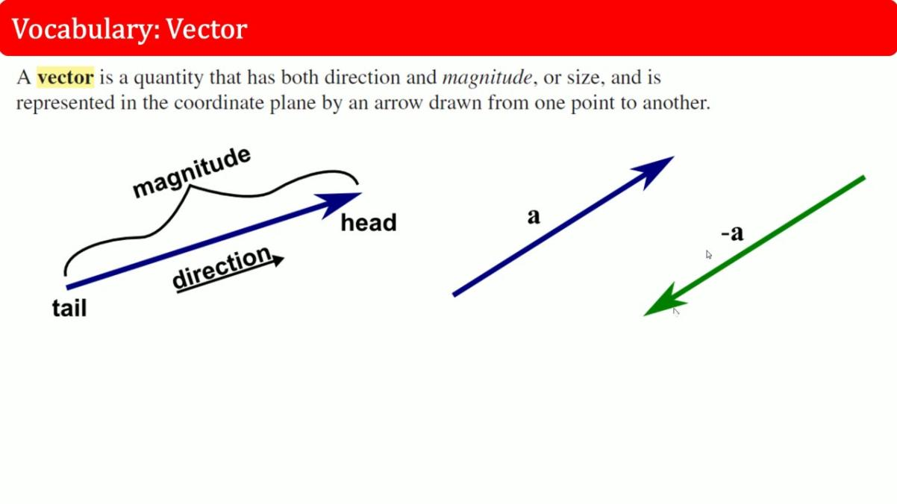
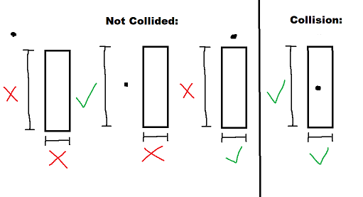
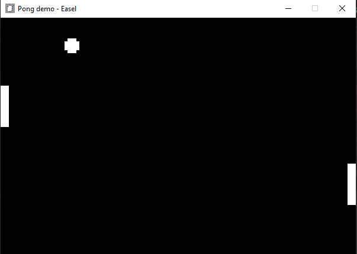

# Creating our own Components
In the previous tutorial, we created entities to represent our game objects, and by using a ``Sprite`` component, drew them to the screen!

Components are how we program behavior and attribute data to the entities we can utilize in our game. To represent this, let's create our Ball and Paddle logic!

In your project, create a new directory called Components. In there, create two files, one named ``Ball.cs`` and another named ``Paddle.cs``.
You should have class definitions inside of them, just like this:

```cs
// Ball.cs

// The namespaces defined here are relative to my project, make sure you
// recognize that it'll be based on your project name, not GramPong.
namespace GramPong.Components;

public class Ball
{
    
}
```
```cs
// Paddle.cs
namespace GramPong.Components;

public class Paddle
{
    
}
```
## Paddle

We'll start by implementing the paddle component and its behavior. In GramEngine, components (just like scenes) have their own defined ``Initialize`` and ``Update`` methods that behave the same way. We'll start by inheriting the ``Component`` class. To do this, let's import all of the necessary namespaces that we'll need from GramEngine beforehand.

At the top of ``Paddle.cs``, import the following:

```cs
using System.Numerics;
using GramEngine.ECS;
using GramEngine.ECS.Components;
using GramEngine.Core.Input;
```

Now we'll inherit the ``Component`` class unto our ``Paddle`` to implement it as one, so that we can add this component to any ``Entity`` as we so please.

```cs
//...
namespace GramPong.Components;

public class Paddle : Component // NEW
{
    
}
//...
```

Note that in GramEngine, every single entity can only hold one of each type of component. So for example, every entity can only ever hold one of the ``Paddle`` component that we are currently creating.

Let's also quickly define a ``Side`` enum, so that we have some sort of representation for which side the paddle is on. Right after the namespace declaration, and before the class declaration, define the following.

```cs
//...
namespace GramPong.Components;

// NEW
public enum Side
{
    Left,
    Right
}

//...
```
Now we'll declare some variables that we'll utilize to define some details about each paddle.

```cs
//...
public class Paddle : Component
{
    // NEW
    public Side PaddleSide;
    private float speed;
    private float velocity;
    public Vector2 PaddleSize;
    public int Score;

    // The set keybinds to use to control either side.
    private Keys[] leftPlayerInputs = { Keys.W, Keys.S};
    private Keys[] rightPlayerInputs = { Keys.Up, Keys.Down };

//...
/...
```

The declared variables are relatively self explanatory, but we'll go over them anyway. ``PaddleSide`` is used to store which side each paddle is on, as represented using the ``Side`` enum defined earlier. The speed and velocity of the component is stored as floating point integers, and we'll use them to manipulate the position of the paddles as we so please. The size of the paddle is stored as a ``Vector2`` (under ``System.Numerics``) which handily has two accessible values that we can use for the X and Y sides. Finally, we're storing the scores for each player on their respective paddles, as well as defining which buttons are going to trigger the inputs of the paddles.

> Quick Note: If you want to modify the keybinds for moving the paddles, feel free to do so! ``GramEngine``'s ``Keys`` enum stores a definition for just about every keyboard key out there! Just substitute the values in the inputs array for either player.

Next, let's actually define these values. Create a constructor for our ``Paddle`` component, so that the respective side and the intended speed can be defined.

```cs
//...
// The set keybinds to use to control either side.
private Key[] leftPlayerInputs = { Key.W, Key.S };
private Key[] rightPlayerInputs = { Key.Up, Key.Down };

// NEW
public Paddle(Side side, float speed)
{
    PaddleSide = side;
    this.speed = speed;
    Score = 0;
}

//...
```

Now, we'll define the values that need to be known upon the Scene's initialization, rather than when the component is created. We want to make sure our gameobjects exist, and we know that everything must be loaded when the game starts up, vs when our object is created. To do this, we'll utilize the component's ``Initialize`` method. After the constructor, override it as so:

```cs
//...

public override void Initialize()
{
    base.Initialize();
    // We store the paddle size so that we can use it when checking collisions in the ball component
    // (otherwise, we'd have to call getcomponent<sprite>() per frame)
    var paddleWidth = ParentEntity.GetComponent<Sprite>().Width;
    var paddleHeight = ParentEntity.GetComponent<Sprite>().Height;

    // We also want to adjust the paddle size for any scaling we might have done
    PaddleSize = new Vector2(paddleWidth * Transform.Scale.X, 
        paddleHeight * Transform.Scale.Y);
}

//...
```

Now we can define our game logic! In a game of pong, each paddle just needs to exist as something to collide with, and to be able to move up and down. We'll define this logic in our ``Update`` method, which is called once every frame. (Don't worry, we'll break all of this down.)

```cs
//...
public override void Update()
{
    base.Update();
    
    // Basic switch statements that moves each paddle to its accordingly bound keys, clamped to screen bounds.
    velocity = 0f;

    switch (PaddleSide)
    {
        case Side.Left:
            if (InputManager.GetKeyPressed(leftPlayerInputs[0]))
                velocity = -speed;
            if (InputManager.GetKeyPressed(leftPlayerInputs[1]))
                velocity = speed;
            break;
    
        case Side.Right:
            if (InputManager.GetKeyPressed(rightPlayerInputs[0]))
                velocity = -speed;
            if (InputManager.GetKeyPressed(rightPlayerInputs[1]))
                velocity = speed;
            break;
    
        default:
            break;
    }

    Transform.Position.Y += velocity * gameTime.DeltaTime;

    var yOffset = PaddleSize.Y / 2;
    Transform.Position.Y = Math.Clamp(Transform.Position.Y, yOffset, GameStateManager.Window.settings.BaseWindowHeight - yOffset);

}
//...
```

We'll deconstruct this logic by going line by line. First, you'll notice that we set the velocity to 0 every frame. This is so that whenever we set the velocity by pressing a key, we're resetting it to not move when a key isn't being pressed. Otherwise, if we set the velocity to a positive value, it would just continually slide upwards forever.

Afterwards, we define a switch statement based on the paddle's side, so that we can differentiate which input keybind array we want to use. We know that the first element of the array is the key to go up, and the second element is the key to go down, so we set the velocity of the paddle accordingly. 

> Quick Note: Remember from chapter 2 that in graphics programming, the origin, or (0, 0) is usually set at the top left, so decreasing the Y value actually means we go up, or closer to 0, rather than down, hence why negative speed is set to the velocity in representation to going up. You can revisit the [Transform](2%20-%20Creating%20Game%20Objects.md#Transform) section if you feel like this is unclear.

After the velocity of the paddle for this frame is defined, we're going to go ahead and modify the position of the entity this component is attached to using it. The line ```Transform.Position += velocity * Time.DeltaTime;``` applies an actual change to the current position, with the speed being the intended velocity of the object, equalized with ``GameTime.DeltaTime``. 

``GameTime.DeltaTime`` is the approximate time between frames, given by the engine, which we use here in order to make sure the paddle travels the same distance in a given amount of time for the same velocity. This means that the speed of the paddle will be the same for a given velocity, regardless of if the game runs at 60 fps, or 300 fps.

Finally, we're making sure the paddle can never leave the bounds of the screen, by clamping (limiting) its position to the point where the top and bottom sides meet the edges of the screen. Since the position of the entity is centered at the center of the paddle, we simply apply an offset before calculating the clamped position.

With all that out of the way, we're done implementing our ``Paddle`` component! To view all of our hard work, let's go back to ``MainScene.cs`` and add this component to our paddle entities. 

To begin with, we'll let the main scene know that our components exist. At the top of ``MainScene.cs``, add the Components namespace your ``Paddle`` class is defined in. (It'll probably be ``<YourProjectName>.Components``)

```cs
using System.Numerics;
using GramEngine.Core;
using GramEngine.ECS;
using GramEngine.ECS.Components;
// NEW
// Make sure that instead of GramPong, it's set to what you defined the namespace in Paddle.cs is.
using GramPong.Components;
```

Moving to the class definition, we'll define a couple of constants for the speed of our paddle (and ball, for later!).

```cs
//...
public class MainScene : Scene
{
    public const float PaddleSize = 7f;
    public const float BallSize = 5f;

    // NEW
    public const float BallSpeed = 300f;
    public const float PaddleSpeed = 500f;
    //...
```
I've set these to values that I think feel nice, but feel free to change them as you'd like!

Now in ``MainScene.cs``, inside of the ``Initialize`` method add our new ``Paddle`` component underneath where we added the ``Sprite`` components, like so.

```cs
protected override void Initialize()
{
    //...
    ball.AddComponent(new Sprite(ballTexture));
    leftPlayer.AddComponent(new Sprite(paddleTexture));
    rightPlayer.AddComponent(new Sprite(paddleTexture));

    // NEW
    leftPlayer.AddComponent(new Paddle(Side.Left, PaddleSpeed));
    rightPlayer.AddComponent(new Paddle(Side.Right, PaddleSpeed));
    //...
}
```

With everything set and done, go ahead and try running your project! You should be able to move the left and right paddles up and down using whatever keys you set for the keybinds! (W/S for left, Up/Down arrow for right if you didn't change them) 



## Ball
Now that we're all done with our paddles, let's get to bouncing our ball!

Just like for ``Paddle.cs``, at the top of ``Ball.cs``, import the following:
```cs
using System.Numerics;
using GramEngine.ECS;
using GramEngine.ECS.Components;
```

On our ``Ball`` class, inherit the ``Component`` class.

```cs
//...
namespace GramPong.Components;

public class Ball : Component
{
    
}
//...
```
To begin implementation, we'll declare some variables to use to store important data that we'll need the ball to have during gameplay. In our ``Ball`` class, declare the following:

```cs
//...
public class Ball : Component
{
    private Vector3 velocity;
    private float speed;
    private float radius;
    private Entity[] paddles;

}
```
We'll also create a constructor for our class defining the predetermined values we want on the ``Ball`` component's creation. 

```cs
//...
private Entity[] paddles;

// NEW
public Ball(float radius, float speed)
{
    this.radius = radius;
    this.speed = speed;
}
//...
```
The ball's velocity will be decided during gameplay and change throughout, so we'll leave it be for now. 

We also defined an ``Entity`` array variable to store references to our paddles, so that we don't need to constantly need to grab all the entities with paddles every frame. We're defining this variable in ``Initialize`` and not the constructor so that we can safely grab all of our gameobjects upon the game starting up, and not on the ``Ball``'s creation. 

#### Tags
In order to tell our program what entities are paddles, we'll set the ``Tag`` property of the ``Entity`` objects we're to set our paddles on. In ``MainScene.cs``, right under where we instantiated our entities, we'll set a "paddle" tag to our paddle entities:
```cs
public override void Initialize()
{
    //...
    // We create our paddle and ball entities, add appropriate sprite and associated components, then add them to the scene.  
    ball = new Entity();  
    leftPlayer = new Entity();  
    rightPlayer = new Entity();  

    // NEW
    leftPlayer.Tag = "paddle";
    rightPlayer.Tag = "paddle";

    //...
}
```
Back on implementing our ``Ball`` component, let's start working on our ``Initialize`` and ``Update`` methods. In ``Ball.cs``, override your ``Initialize`` method right under you constructor.

```cs
public override void Initialize()
{
    base.Initialize();
    paddles = ParentScene.FindEntitiesWithTag("paddle").ToArray();
}
```

Here, we're using the ``FindEntitiesWithTag`` function under the ``GameScene`` class to grab the entities we associated with that tag just earlier.


Moving on to base game logic, we'll want to write up our ball's behavior in our ``Update`` function.

```cs
public override void Update(GameTime gameTime)
{
    base.Update(gameTime);
    Transform.Position += velocity * gameTime.DeltaTime;


    // Whenever the ball hits the ceiling or floor, make it bounce. 
    // the if statements are split up so we can just set it to a position where it can't get stuck.
    if (Transform.Position.Y <= radius)
    {
        Transform.Position.Y = radius;
        velocity.Y = -velocity.Y;
    }

    if (Transform.Position.Y >= GameStateManager.Window.settings.BaseWindowHeight - radius)
    {
        Transform.Position.Y = GameStateManager.Window.settings.BaseWindowHeight - radius;
        velocity.Y = -velocity.Y;

    }

}
```

We've seen the velocity applied to position before, when we were moving our paddle's y position - same exact concept and logic here.

Next, whenever the ball hits the top or bottom of the screen, we want to make it bounce. We can easily achieve this by simply setting the ball's position to the border of the screen, then reversing the velocity of the ball on the Y axis, as written above.

#### Moving the ball

But wait, we've got all this logic for when the ball hits the bounds of the screen, but we haven't set the velocity to anything or begun moving at all! 

In every round of pong, the ball is usually served towards a direction. This means that we'll need to serve the ball at the beginning of the game (on ``Initialize``) and at the start of every round (after we've scored). Because of this, we're going to write our ball serving logic in a helper function, so we don't rewrite the same code over and over.

After the ``Update`` method, we'll define a new method called ``Serve``, which will center the ball at the middle of the screen and send it flying to whichever side it's needed on.

```cs
// Resets the position of the ball and adds velocity towards the last non scored player.
private void Serve(Side side)
{
    Transform.Position = new Vector3(300f, 200f, 1f);
    if (side == Side.Left)
        velocity = new Vector3(-speed, speed, 0f);
    if (side == Side.Right)
        velocity = new Vector3(speed, speed, 0f);
}
```

Our ``Serve`` function takes a given side, sets the position of the current entity this component is attached to (which in game terms, is our ball object) to the center of the screen, then sets the velocity towards whichever side it was given. Note that unlike the paddles, we're using a ``Vector3`` to represent the velocity of the ball, since we're moving in 2 dimensions. 

> Quick Note: The ``Vector3`` we're using is a representation of an actual vector, like you'd see in physics! The velocity of the ball is a perfect use case for this, since it represents an actual direction, and magnitude in that direction (speed). Note that the z axis is just a requirement by the engine and not relevant in our case, it just represents the order of sprite rendering.



With the ``Serve`` function implemented, we can go ahead and call it in all the places where the ball needs to be served in actual game logic.

Since the ball needs to be served as soon as the game starts, we'll first call it in the ``Initialize`` method.

```cs
//...
public override void Initialize()
{
    base.Initialize();
    paddles = GetEntitiesWithTag("paddle");
    // NEW
    Serve(Side.Right);
}
//...
```

I decided to serve the ball to the right side at the start, you can choose whatever you'd like.

We also want to serve the ball whenever a player scores, so let's hop back into our ``Update`` method and implement some code checking if a player ever does.

```cs
//...
protected override void Update()
{
    //...
    if (Transform.Position.Y >= GameStateManager.Window.settings.BaseWindowHeight - radius)
    {
        Transform.Position.Y = GameStateManager.Window.settings.BaseWindowHeight - radius;
        velocity.Y = -velocity.Y;
    }

    // NEW
    // If the ball hits the left or right ends of the screen, score for the appropriate player.
    if (Transform.Position.X <= radius)
    {
        Serve(Side.Left);
        paddles[1].GetComponent<Paddle>().Score++;
    }
    else if (Transform.Position.X >= GameStateManager.Window.settings.BaseWindowWidth - radius)
    {
        Serve(Side.Right);
        paddles[0].GetComponent<Paddle>().Score++;
    }
}
//...
```

By checking if the position (offset by the radius, so we account for any portion of the ball) ever hits 0, or the width of the screen, we're able to account for which side the ball scores. Since we want to serve the ball to the loser of that round, we'll serve it to the appropriate side that the ball hit, and increment the other player's score by one.

We've got the ball rolling! (hehe) As of right now, the ball can be served, and any scoring applied correctly, but our paddles can't actually ever "hit" the ball. Rather, if we were to run the program right now, our balls would just go right through! To fix this behavior, we're going to have to implement collisions.

#### Checking collisions

We'll write the base logic of how we can check if the ball and the paddle ever collide in a helper function, as to break it down easier. In essence, all we really need to ever check is if the ball is ever inside of our paddle at any given frame. If it is, we can reverse its X axis velocity and send it flying over to the other side! To do this, we can check if the ball's position is between all 4 sides at the respective axis. 

To illustrate how this works, here's a visual example of every possible case for our check.



We know that if the ball is ever inside of the paddle, it's collided with it, and so we can simply correct the ball's position and reverse its X velocity. To make it easier, let's define a helper function to check for collisions.

```cs
private bool CheckCollision(float left, float right, float bottom, float top)
{
    // Shorthands so that our conditional isn't too wordy
    var x = Transform.Position.X;
    var y = Transform.Position.Y;
    return x >= left && x <= right && y >= bottom && y <= top;
}
```

By comparing if it's between all sides, the function will always return ``true`` if it's ever inside of the given rectangle, and ``false`` otherwise.

This implementation isn't foolproof, however. If the ball were to be going at an extremely high speed, it could zoom through the paddle without ever being inside of it, since we're adding the velocity to its position every frame. There's a variety of ways to fix this, of which we won't really implement in this tutorial, but if you're interested you can read up further in [this article](https://en.wikipedia.org/wiki/Collision_detection#Collision_detection_in_computer_simulation).

With our collision checking method done, let's go ahead an implement the actual logic utilizing it. Inside our ``Update`` method, we'll implement the following right after our score checking code:

```cs
//...
protected override void Update()
{
    //...
    else if (Transform.Position.X >= GameStateManager.Window.settings.BaseWindowWidth - radius)
    {
        Serve(Side.Right);
        paddles[0].GetComponent<Paddle>().Score++;
    }

    // NEW!!!
    // Check if the ball has collided with either paddle.
    foreach (var entity in paddles)
    {
        // Could also store components as well to avoid constant getcomponent calls?
        var paddle = entity.GetComponent<Paddle>();
        var paddleX = entity.Transform.Position.X;
        var paddleY = entity.Transform.Position.Y;
        if (CheckCollision(
                paddleX - paddle.PaddleSize.X / 2 - radius,
                paddleX + paddle.PaddleSize.X / 2 + radius, 
                paddleY - paddle.PaddleSize.Y / 2 - radius,
                paddleY + paddle.PaddleSize.Y / 2 + radius))
        {
            // If the ball has collided with either paddle, make it bounce.
            velocity.X = -velocity.X;
        }
    }
}
```

In the code above, we check if we've collided with either paddle in our game, and if we have, we simply reverse the X velocity, making it "bounce" off to the other side.

With that, we've officially finished the ``Ball`` component! Let's go ahead and add it to our ball entity. In ``MainScene.cs``, head over to the ``Initialize`` method and locate where you added your ``Sprite`` component to the ball entity. We'll fit our ``AddComponent`` call right under it, just for good measure.

```cs
//...
protected override void Initialize()
{
    //...
    ball.AddComponent(new Sprite(ballTexture));
    // NEW
    ball.AddComponent(new Ball(12.5f, BallSpeed));
    //...
}
//...
```
The ball image is 5x5, and we're scaling it up by 5 (remember the ``BallSize`` constant) which makes it 25x25 units, so we're setting the radius as 12.5.

Now we're done! Go ahead and run the game, and enjoy a nice game of pong!



Even with all this though, something doesn't feel right. We're missing a few key features of pong, like the iconic hitsound and the score overlays! We'll go over all that in the next chapter. For now, pat yourself on the back!
