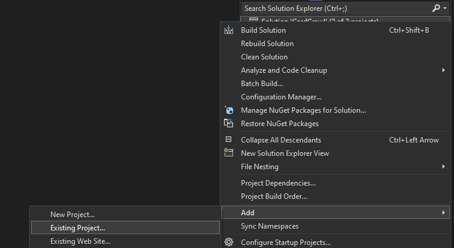
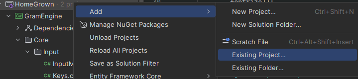
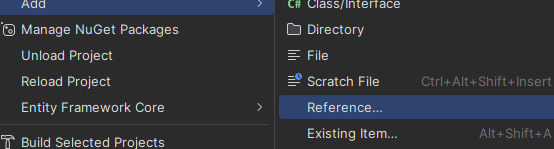

# Getting Started
There isn't a nuget package or anything set up yet, (coming soon(?)) so for now, just clone the main repository [here](https://github.com/kofu145/GramEngine).

After you've done so, just create any new project, add the main Gram project from the solution you cloned to your new project as a reference, and walla! You're done!

For Visual Studio:
After creating a new project, right click on the Solution, click Add > Existing Project and add the GramEngine.csproj file to your solution. 

Upon doing so, simply right click the dependencies of your main game project and [add GramEngine as a dependency](https://learn.microsoft.com/en-us/visualstudio/ide/how-to-add-or-remove-references-by-using-the-reference-manager?view=vs-2022).

For Jetbrains Rider:
Right click your solution, go to Add > Existing Project and select your GramEngine.csproj file wherever you cloned GramEngine to. 

From there, right click your game's project file (not your solution!) then go Add > Reference and check off GramEngine in the list. 

